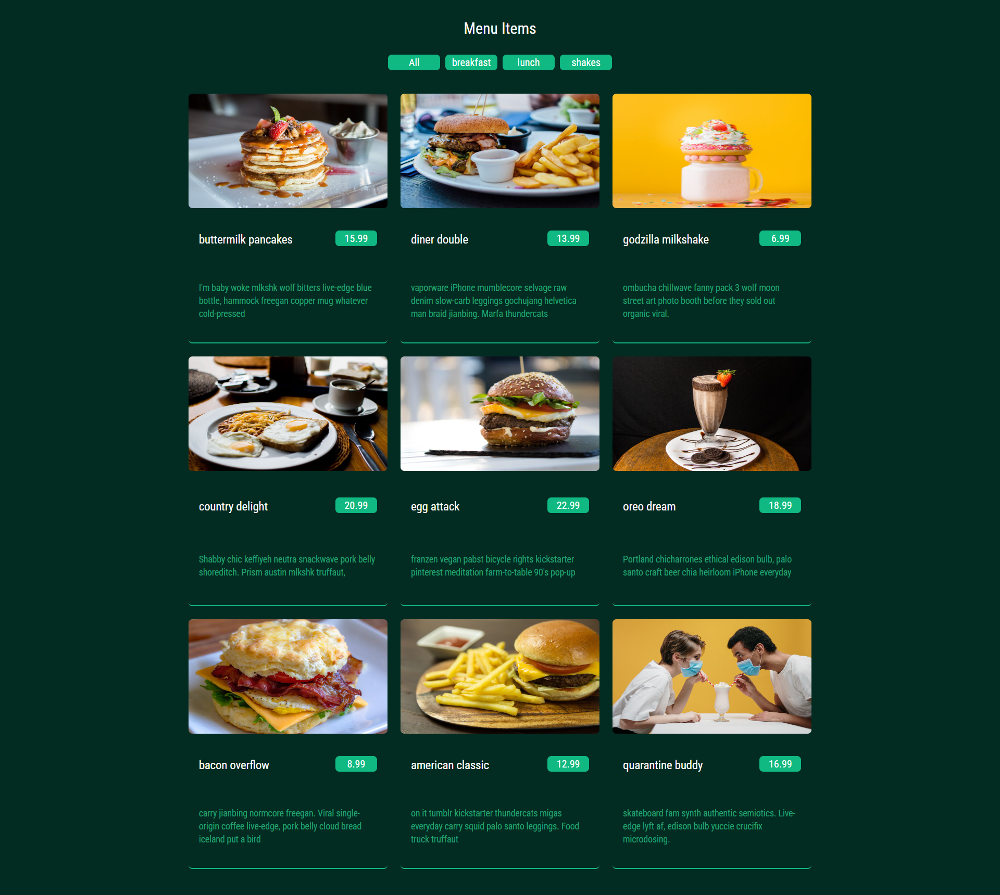

# 🍽️ Menu Page

Welcome to the Menu Page repository! This project is a sub-functionality implementation for a food ordering app, showcasing a dynamic menu page built with React, Tailwind CSS, and Vite. Users can filter menu items based on categories, making it an interactive and user-friendly component for any food-related application.

## 🚀 Live Demo
Check out the live demo : (https://main--menu-items-00.netlify.app/).

## 📋 Table of Contents
- [Features](#features)
- [Technologies Used](#technologies-used)
- [Screenshot](#screenshot)
- [Getting Started](#getting-started)
- [Project Structure](#project-structure)
- [Contributing](#contributing)
- [License](#license)

## ✨ Features
- Display menu items with images, titles, prices, and descriptions.
- Filter menu items by categories such as breakfast, lunch, and shakes.
- Responsive design with Tailwind CSS.
- Smooth animations and transitions for a better user experience.

## 🛠 Technologies Used
- **React**: JavaScript library for building user interfaces.
- **Tailwind CSS**: Utility-first CSS framework for styling.
- **Vite**: Next-generation front-end tooling for fast development.
- **JavaScript (ES6+)**: Programming language for the web.
- **HTML5 & CSS3**: Markup and styling languages.

## Screenshot


## 🏁 Getting Started
Follow these steps to get a copy of the project up and running on your local machine.

### Prerequisites
- Node.js
- npm or yarn

### Installation
1. Clone the repository:
   ```sh
   git clone https://github.com/Ihtesham-Latif/menu-page.git
   ```
2. Navigate to the project directory:
   ```sh
   cd menu-page
   ```
3. Install dependencies:
   ```sh
   npm install
   # or
   yarn install
   ```

### Running the Project
Start the development server:
```sh
npm run dev
# or
yarn dev
```
Open your browser and navigate to `http://localhost:3000` to see the application in action.

## 📂 Project Structure
```
menu-page/
├── public/
│   └── images/           # Contains images of menu items
├── src/
│   ├── components/
│   │   ├── Button.js     # Button component for category filtering
│   │   ├── MenuItem.js   # MenuItem component to display individual menu items
│   │   ├── Data.js       # Dummy data for menu items
│   ├── App.css           # Styling for the app
│   ├── App.jsx           # Main app component
│   └── index.js          # Entry point of the app
├── .gitignore            # Files and directories to ignore in git
├── package.json          # Project metadata and dependencies
└── README.md             # Project documentation
```

## 🤝 Contributing
Contributions are welcome! Please follow these steps to contribute:
1. Fork the repository.
2. Create a new branch (`git checkout -b feature/your-feature`).
3. Commit your changes (`git commit -m 'Add some feature'`).
4. Push to the branch (`git push origin feature/your-feature`).
5. Open a pull request.

## 📜 License
This project is licensed under the MIT License. See the [LICENSE](LICENSE) file for details.

